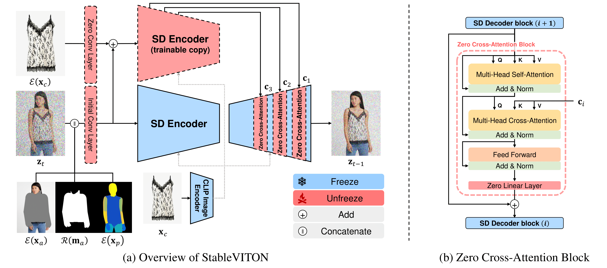

# TryOn Pipeline with Diffusion Inpainting

This repository contains the code for a TryOn pipeline that utilizes Diffusion Inpainting. Follow the instructions below to set up the necessary dependencies and run the pipeline. This API based on the model presented by the paper StableVITON: Learning Semantic Correspondence with Latent Diffusion Model for Virtual Try-On. To understand how the model works refer to the link [here.](https://rlawjdghek.github.io/StableVITON/)



## Setup Dependencies

To install the required dependencies, follow these steps:

1. Make sure you have Python installed on your system.
2. Clone this repository to your local machine.
3. Navigate to the project directory.
4. Run the following command to install the dependencies from the `requirements.txt` file:

```shell
pip install -r requirements.txt
```

## Running the Pipeline

To run the TryOn pipeline, follow these steps:

1. Make sure you have completed the setup process as mentioned above.
2. Locate the `api.py` file in the project directory.
3. Run the following command to start the pipeline:

```shell
python api.py
```

This will start the pipeline and you can access it through the provided API.
