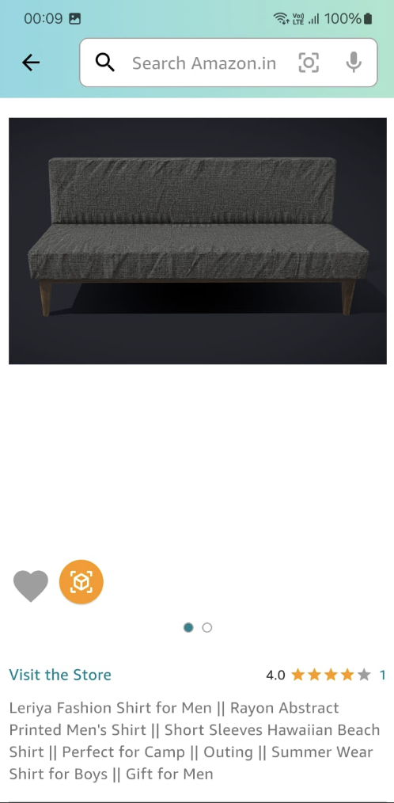

# AiDA - **Virtual Shopping Assistant for Human-like Experiences**

## Overview

A realistic virtual assistant that mimics a seasoned sales executive, interacting with users through visual and audio channels to offer personalized product recommendations and advice. It offers advanced AR technology to provide virtual try-ons for clothes and virtual placement for furniture, allowing users to visualize better to make an informed purchasing decision.

## Demo

The application demo can be found in the link [here](https://drive.google.com/drive/folders/1xRIUcLRfiWLs1h7BuCB4ogYSaAvG9y2i?usp=sharing)

## Key Features

##### **Visual and Audio Interaction**

A life-like shopping assistant using realistic avatars generated using RAD-NeRF with audio driven by user voice queries.

 

##### Virtual TryOns powered by AR and GenAI

Using AR and GenAI, we enhance Amazon Prime's "Try Before You Buy" with virtual try-ons, giving customers a realistic view of items. We use the State-of-the-art Diffusions Models and ARKit for providing potential customers to try on/out products before they buy increasing customer engagement and reduce drop off rates.

      

   

##### Personalized Recommendations

We leverage a Retrieval Augement Generation (RAG) system to generate a lifelike response and create an underlying conversation agent making a users shopping experience with Amazon as realistic as it can get to a physical shop.

##### Cross-category Expertise

AiDA aims to be a jack of all trades and offer to adeptly assists with products across electronics, furniture, and fashion categories.

##### Real-time Feedback and Adaptation

AiDA can adapt in near real-time to user suggestions and feedback and can tune its response accordingly to provide an end-to-end shopping experience.

We aim to present AiDA in all its glory in a portable form in form of a mobile application.

## Application Workflow

## Application Architecture

We have the following services for the backend of our application

##### Virtual Assitant Service:

This serivce is responsible for processing user inputs obtained from the mobile app and run an end-to-end pipeline for AiDA which involves response generation and document retrieval using RAG, Audio as well as Avatar Generation. As seen below we leverage the state of the art open-source LLMs like Llama2 for response generation, Text2Speech Diffusion model for lifelike audio response generation and RAD-NeRF for human-like avatar generation. These modules are easily replacable by AWS equivalent offerings like Transcribe, Polly and Sagemaker.

##### AR Pipeline Service:

Our AR pipeline for object placement tryons require 3D-Models which are easy to procure for categories like furnishing and can leverage a phone's camera to create realistic placement of objects as shown below.

##### Virtual TryOn Service:

We leverage the state-of-the-art Diffusion Models for the virtual try-on service where all we require is the product image and one of your images to give an idea how would you looks in that favorite dress before you buy as seen below.

## Technologies used

1. Flutter for the mobile application.
2. NodeJS
3. Python with Flask to expose APIs
4. Langchain
5. Llama CPP Python for using Llama CPP for low latency inference.
6. RAD-NeRF - A neural radiance fields used for creating the realistic avatar bringing AiDA to life.
7. Chroma DB as the vector db to cache embeddings for document retrieval.
8. MongoDB for storing the general product databse.

## Project Structure

The repository consist of all the codebase required to build and run the product in the following branches

1.  [AvatarGeneration](https://github.com/shivankar-p/AiDA/tree/AvatarGeneration) - Consist of RAD-NeRF and modification made for the API.

2.  [RAGPipeline](https://github.com/shivankar-p/AiDA/tree/RAGPipeline) - Consist of the RAG pipeline for document retrieval along with the Text2Speech pipeline exposed using an API.

3.  [Master](https://github.com/shivankar-p/AiDA/tree/master) - This branch consist of the AR integration with the flutter app that is the mobile app required to experience AiDA.

Each branch is accompanied by its own README to setup and reproduce the results.

## Setup Instruction for branch Master

1. Make sure you have setup Flutter by following the guide [here.](https://docs.flutter.dev/get-started/install)
2. Once installed, clone this branch of the repository and run command `flutter pub get `.
3. Finally run command `flutter run`. Make sure you have either setup a AVD or connected a physical device via USB. The same can be done by following the guide [here.](https://docs.flutter.dev/get-started/install/linux/android)

## Team Members

[Monjoy Narayan Choudhury](https://www.linkedin.com/in/monjoy-narayan-choudhury-a424b3200/)

[Naitik Solanki](https://www.linkedin.com/in/naitik-solanki-44511420a/)

[Shivankar Pilligundla](https://www.linkedin.com/in/shivankarpi/)

## Datasets used

For database, vector db and RAG we use the following as the dataset:

1. Laptops Dataset - [Link](https://www.kaggle.com/datasets/surajksharma7/laptop)
2. Fashion Dataset - [Link](https://www.kaggle.com/datasets/hiteshsuthar101/myntra-fashion-product-dataset)
3. Furniture Dataset - [Link](https://www.kaggle.com/datasets/crawlfeeds/furniture-products-dataset-from-amazon)
